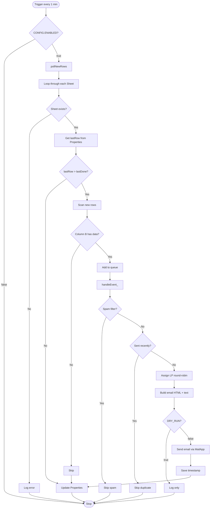
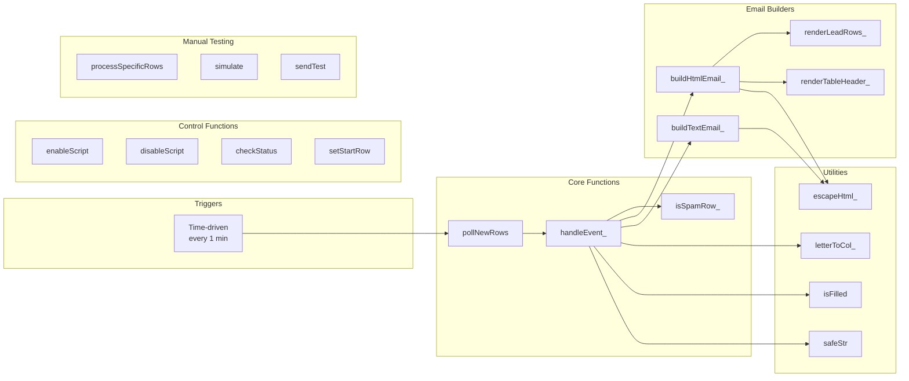
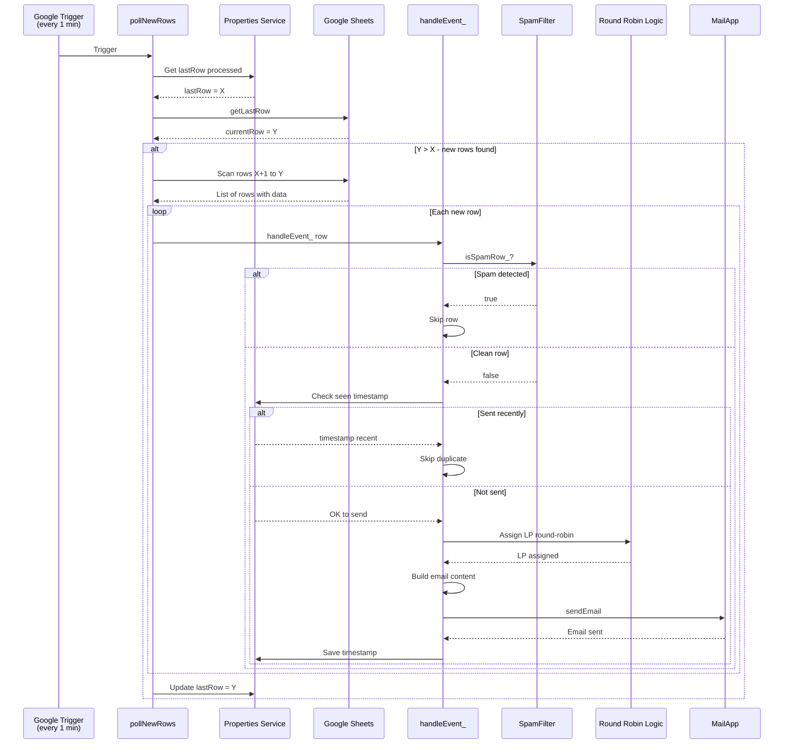
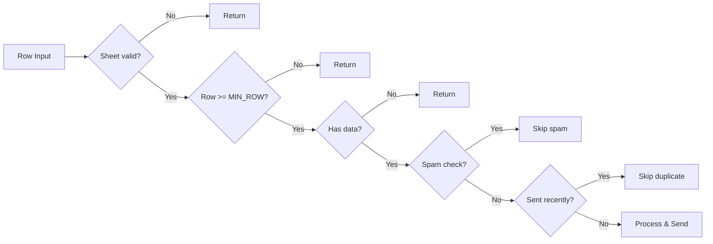
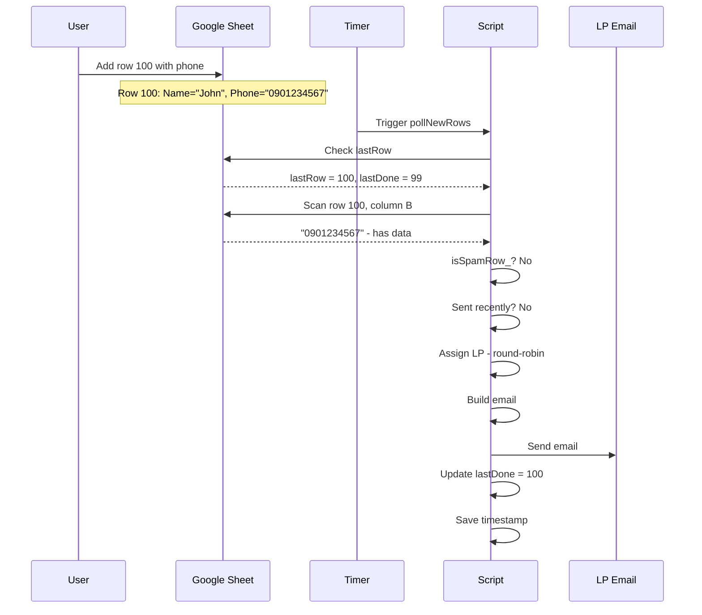
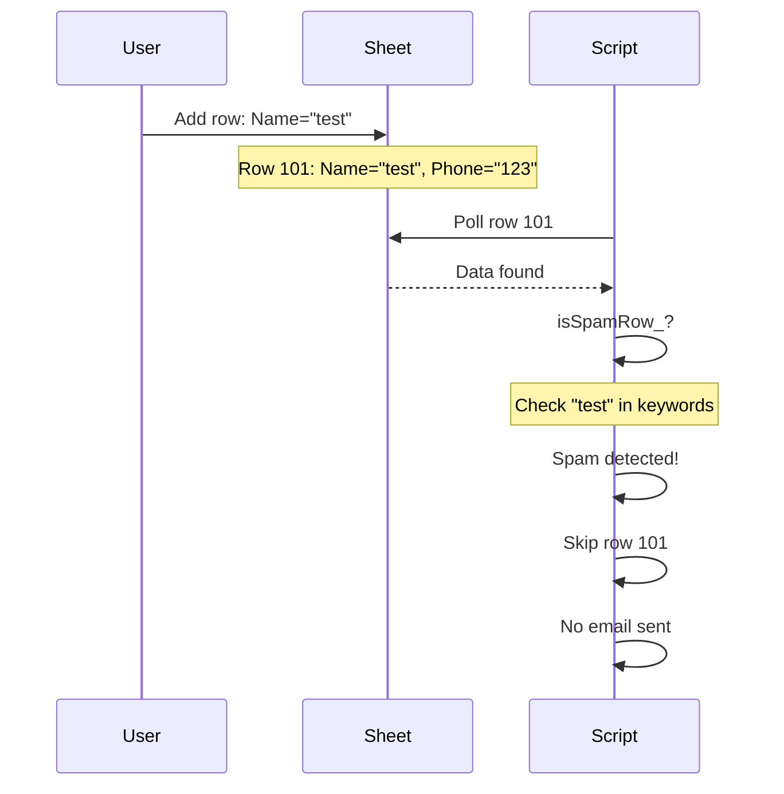
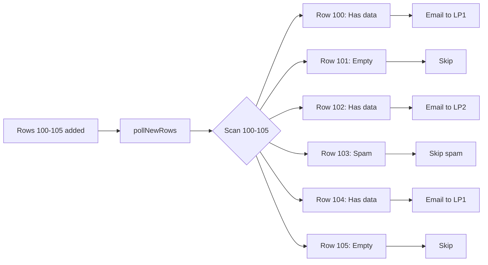
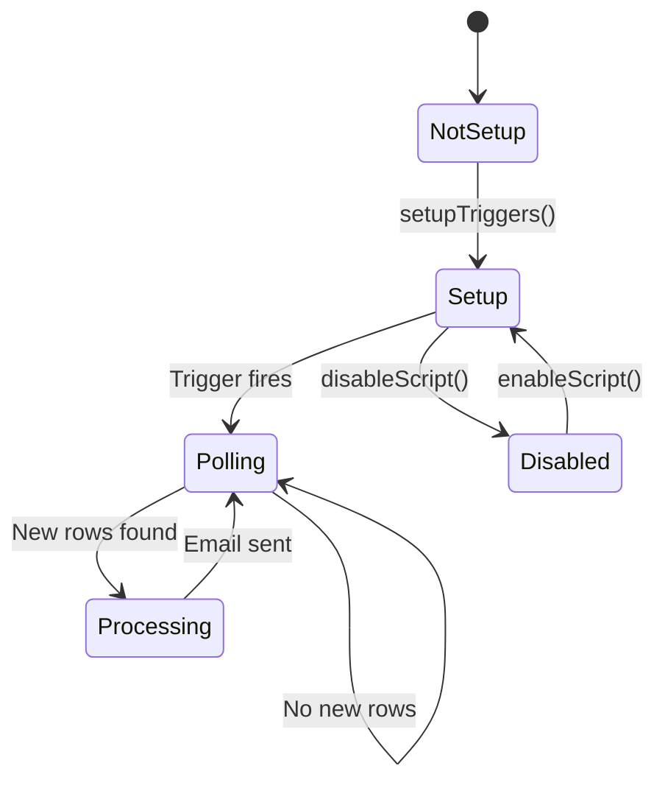

# Round Robin Lead Notifier - Workflow Mapping - 16 Dec 2025

## 📋 System Overview

This script automatically distributes leads from Google Sheets and sends email notifications to TCV.

**Trigger mechanism**: Time-driven polling (every 1 minute)

---

## 🔄 Main Workflow



---

## 🏗️ Component Architecture



---

## 📊 Data Flow



---

## 🎯 Key Components

### 1. Trigger Setup
**Function**: `setupTriggers()`

```javascript
setupTriggers(); // Run once to setup
```

**Actions**:
- Delete old triggers (if any)
- Create time-driven trigger running every 1 minute
- Call `initPollBaseline()` to set initial baseline

---

### 2. Polling Mechanism
**Function**: `pollNewRows()`

**Flow**:
1. Check `CONFIG.ENABLED`
2. Loop through each sheet in `CONFIG.SHEET_NAMES`
3. Compare `lastRow` (current) vs `lastDone` (from Properties)
4. If new rows exist → scan and check column B (Phone)
5. Send each row with data to `handleEvent_()`

**State Management**:
- Uses `PropertiesService` to store `lastRow:${sheetId}`
- Each sheet has its own state

---

### 3. Event Handler
**Function**: `handleEvent_(e, sourceType)`

**Validation Chain**:


**Processing Steps**:
1. **Validation**: CONFIG, sheet, row number
2. **Data extraction**: Get Name, Phone, Leadcode
3. **Spam filter**: Check keywords in columns A, B, D, E, H
4. **Duplicate check**: Check timestamp (5-minute window)
5. **LP assignment**: Round-robin from LP_POOL
6. **Email generation**: HTML + plain text
7. **Send email**: MailApp.sendEmail()
8. **State update**: Save timestamp, update LP index

---

### 4. Spam Filter
**Function**: `isSpamRow_(sh, rowNum)`

**Keywords** (47 total):
- Test/Demo: `test`, `demo`, `sample`, `thử`
- Spam/Fake: `spam`, `fake`, `giả`, `lừa đảo`
- Invalid: `xxx`, `aaa`, `null`, `invalid`
- Test names: `nguyen van a`, `tran thi b`
- Test phones: `0000000000`, `1111111111`
- Bot: `bot`, `robot`, `automated`
- Profanity:_________________________________
- Suspicious: `hack`, `virus`, `malware`

**Check columns**: A, B, D, E, H  
**Method**: Case-insensitive substring match

---

### 5. Round Robin Logic
**Location**: Inside `handleEvent_()` with Lock

```javascript
// Lock for thread-safety
const lock = LockService.getDocumentLock();
lock.waitLock(30000);

// Get current LP index
let lpIdx = parseInt(props.getProperty(keyIdx) || '0', 10);

// Assign LP and increment
const lp = pool[lpIdx % pool.length];
lpIdx++;

// Save index
props.setProperty(keyIdx, String(lpIdx));
```

**Features**:
- Thread-safe with `LockService`
- Each sheet has its own LP index
- Auto wraps when reaching end of pool

---

### 6. Email Builder
**Functions**: `buildHtmlEmail_()`, `buildTextEmail_()`

**HTML Email Structure**:
```
┌─────────────────────────────────┐
│ Header - Brand + Sheet info     │
├─────────────────────────────────┤
│ Table:                          │
│ ┌───┬────────┬────────┬────────┐│
│ │ # │ Name   │ Phone  │Leadcode││
│ ├───┼────────┼────────┼────────┤│
│ │100│John Doe│0901... │LC-123  ││
│ └───┴────────┴────────┴────────┘│
├─────────────────────────────────┤
│ LP Note - Round-robin info      │
└─────────────────────────────────┘
```

**Theme**: Customizable via `CONFIG.EMAIL`

---

## 🎮 Control Functions

### Quick Controls

```javascript
// Enable/disable script
enableScript();
disableScript();

// Check status
checkStatus();

// Set starting row
setStartRow(100);      // From row 100
setStartRow('auto');   // Automatic

// Reset to auto
resetToAuto();

// Spam filter controls
enableSpamFilter();
disableSpamFilter();

// Dry run - test mode
enableDryRun();        // Log only, no emails
disableDryRun();       // Send real emails
```

---

## 🧪 Manual Testing Functions

### 1. Process Specific Rows
```javascript
processSpecificRows([100, 101, 102]);
```

### 2. Process All Pending
```javascript
processAllPendingRows();
```

### 3. Simulate
```javascript
simulate(2);  // Simulate processing row 2
```

### 4. Send Test Email
```javascript
sendTest();  // Send test email with dummy data
```

### 5. Validate Config
```javascript
validateConfig();  // Check configuration
```

---

## 🔧 Configuration

### CONFIG Object

```javascript
CONFIG = {
  ENABLED: true,                    // Master switch
  START_FROM_ROW: null,             // Auto or specific row
  DRY_RUN: false,                   // Test mode
  
  RECIPIENTS_CC: [...],             // CC emails
  LP_POOL: [{name, email}, ...],    // LP list
  
  SHEET_NAMES: [...],               // Target sheets
  TARGET_COLUMN: 'B',               // Trigger column
  DATA_COLS: {                      // Data columns
    NAME: 'A',
    PHONE: 'B',
    LEADCODE: 'F',
    COL_D: 'D',
    COL_E: 'E',
    COL_H: 'H'
  },
  
  SPAM_FILTER: {
    ENABLED: true,
    CASE_SENSITIVE: false,
    KEYWORDS: [...],
    CHECK_COLUMNS: ['A','B','D','E','H']
  },
  
  MIN_ROW: 2,
  MAX_LINES: 50,
  
  EMAIL: {
    brand: '...',
    primary: '#C00000',
    bg: '#f7f7f9',
    text: '#222',
    border: '#e5e7eb'
  }
}
```

---

## 📝 Example Scenarios

### Scenario 1: New Lead Added



**Timeline**:
- T+0s: User adds row
- T+60s: Trigger fires
- T+61s: Email sent
- T+120s: Next trigger (no new rows)

---

### Scenario 2: Spam Detected



**Result**: Row skipped, no email sent

---

### Scenario 3: Multiple New Rows



**Result**: 3 emails sent (rows 100, 102, 104) with round-robin LP assignment

---

## 🛡️ Safety Features

### 1. Duplicate Prevention
- **Mechanism**: Timestamp in Properties
- **Window**: 5 minutes
- **Key**: `seen:${sheetId}:${rowNum}`

### 2. Spam Filter
- **Check**: 47 keywords
- **Columns**: A, B, D, E, H
- **Method**: Case-insensitive substring

### 3. Validation Chain
- Sheet exists
- Row >= MIN_ROW
- Has data in trigger column
- Not spam
- Not sent recently

### 4. Thread Safety
- **Lock**: `LockService.getDocumentLock()`
- **Timeout**: 30 seconds
- **Scope**: Per document

### 5. Error Handling
- Try-catch blocks
- Console logging
- Email error notifications

---

## 🔍 Debugging Tips

### 1. Check Status
```javascript
checkStatus();
// Output: 
// ✅ Round Robin status: ON
// 📍 Starting row: Automatic (current last row)
```

### 2. Validate Configuration
```javascript
validateConfig();
// Checks sheets, columns, LP pool, email quota
```

### 3. Enable Dry Run
```javascript
enableDryRun();
// Log only, no real emails sent
```

### 4. Test Specific Row
```javascript
simulate(100);
// Simulate processing row 100
```

### 5. Check Logs
- Execution Logs in Google Apps Script Editor
- Look for: ⚠️, ❌, ✅, 📧 icons

---

## 📊 State Management

### Properties Service Keys

| Key | Value | Purpose |
|-----|-------|---------|
| `lastRow:${sheetId}` | Integer | Last processed row |
| `lpIdx:${sheetId}` | Integer | Current LP index |
| `seen:${sheetId}:${rowNum}` | Timestamp | Email sent time |

### Lifecycle



---

## 🎯 Best Practices

### 1. Setup
```javascript
// Run once when setting up new installation
setupTriggers();
```

### 2. Production Use
```javascript
// Ensure correct configuration
CONFIG.ENABLED = true;
CONFIG.DRY_RUN = false;
CONFIG.SPAM_FILTER.ENABLED = true;
```

### 3. Testing
```javascript
// Enable dry run when testing
enableDryRun();
simulate(2);
disableDryRun();
```

### 4. Monitoring
```javascript
// Periodically check status
checkStatus();
validateConfig();
```

---

## 🚀 Quick Start Guide

### 1. Initial Setup
```javascript
// Run in Script Editor
setupTriggers();
```

### 2. Verify
```javascript
checkStatus();
validateConfig();
```

### 3. Test
```javascript
enableDryRun();
sendTest();
// Check logs
disableDryRun();
```

### 4. Production
```javascript
enableScript();
// Script auto-runs every 1 minute
```

---

## 📌 Summary

**Main Workflow**:
1. ⏰ Timer trigger every 1 minute
2. 🔍 Poll sheets to find new rows
3. ✅ Validate & filter spam
4. 🎲 Round-robin assign LP
5. 📧 Build & send email
6. 💾 Update state

**Key Features**:
- ✅ Auto polling every 1 minute
- ✅ Round-robin LP assignment
- ✅ Spam filter with 47 keywords
- ✅ Duplicate prevention (5 min window)
- ✅ Thread-safe with Lock
- ✅ Manual testing functions
- ✅ Flexible configuration


