# Round Robin Lead Notifier - Workflow Mapping

## 📋 System Overview

This script automatically distributes leads from Google Sheets and sends email notifications using a round-robin mechanism.

**Recipients**:
- **Before 1 Dec 2025**: Email notifications to Life Planners (LP)
- **After 1 Dec 2025**: Email notifications to Call Center (TCV)

**Trigger mechanism**: Time-driven polling (every 1 minute)

---

## 📝 Changelog

### 2025-12-22 - Enhanced PII Information & Responsive Email Layout

> **🔐 PII Enhancement**: Added comprehensive Personally Identifiable Information (PII) fields to email notifications

**New PII Fields Added**:
- ✅ **Email Address** (Column D) - Customer contact email for both "Lead info" and "G Lead info" sheets
- ✅ **Date of Birth (DoB)** (Column E) - Customer DOB for "Lead info" sheet only
- ✅ **Intention/Intent** (Column I) - Customer purchase intention for both sheets
- ✅ **Name** (Column A) - Already existing
- ✅ **Phone** (Column B) - Already existing
- ✅ **Leadcode** (Column F) - Already existing

**Email Format Improvements**:
- ✅ Updated email table to include **7 columns** (was 4): #, Name, Phone, Email, DoB, Intention, Leadcode
- ✅ Implemented **responsive email layout** with horizontal scroll to prevent overflow
- ✅ Added **smart truncation**: Email (20 chars) and Intention (25 chars) with hover tooltips
- ✅ Optimized table styling with smaller fonts (10-11px) and compact padding (4-6px)
- ✅ Added viewport meta tag for mobile responsiveness

**Impact**:
- ✅ Emails now display **complete customer profile** with all PII information
- ✅ Email layout is **mobile-friendly** and won't overflow on small screens
- ✅ Long text fields are truncated but **accessible via hover**
- ✅ Better data visibility for Call Center (TCV) and Life Planners (LP)

---

## 🔄 Main Workflow

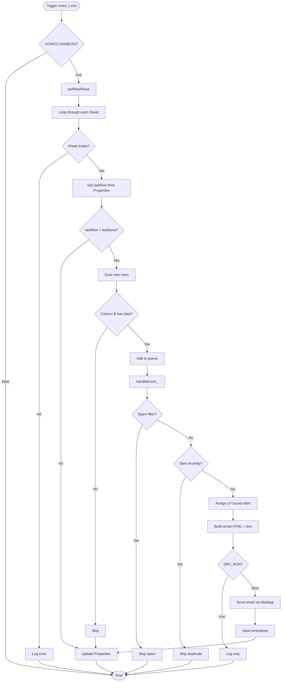

---

## 🏗️ Component Architecture

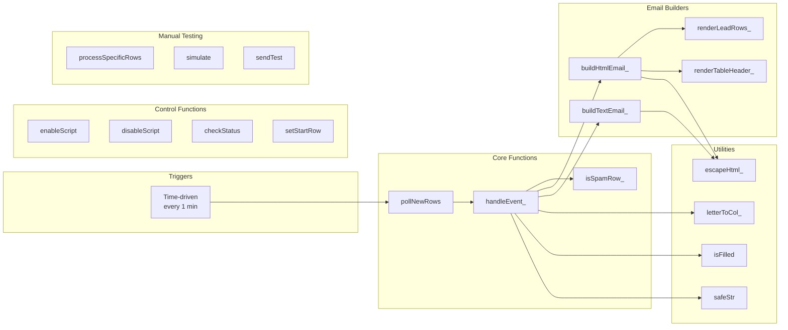

---

## 📊 Data Flow

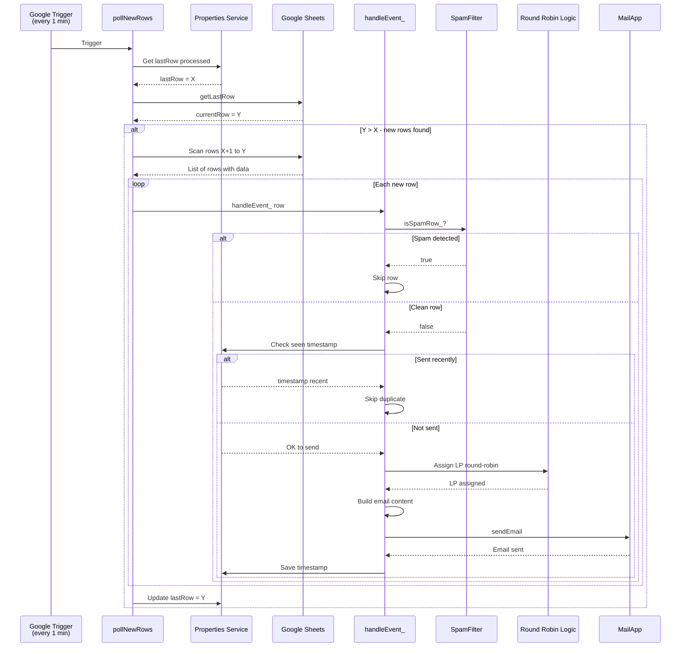

---

## 🎯 Key Components

### 1. Trigger Setup
**Function**: `setupTriggers()`

```javascript
setupTriggers(); // Run once to setup
```

**Actions**:
- Delete old triggers (if any)
- Create time-driven trigger running every 1 minute
- Call `initPollBaseline()` to set initial baseline

---

### 2. Polling Mechanism
**Function**: `pollNewRows()`

**Flow**:
1. Check `CONFIG.ENABLED`
2. Loop through each sheet in `CONFIG.SHEET_NAMES`
3. Compare `lastRow` (current) vs `lastDone` (from Properties)
4. If new rows exist → scan and check column B (Phone)
5. Send each row with data to `handleEvent_()`

**State Management**:
- Uses `PropertiesService` to store `lastRow:${sheetId}`
- Each sheet has its own state

---

### 3. Event Handler
**Function**: `handleEvent_(e, sourceType)`

**Validation Chain**:
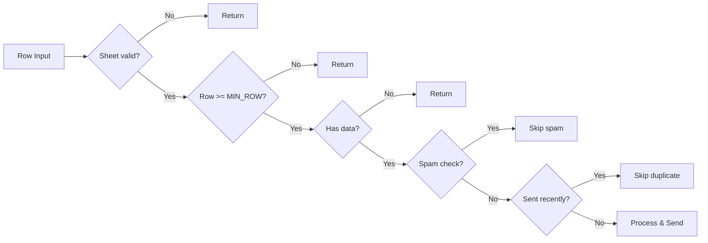

**Processing Steps**:
1. **Validation**: CONFIG, sheet, row number
2. **Data extraction**: Get Name, Phone, Email, DoB, Leadcode, Intention
3. **Spam filter**: Check keywords in columns A, B, D, E, H
4. **Duplicate check**: Check timestamp (5-minute window)
5. **LP assignment**: Round-robin from LP_POOL
6. **Email generation**: HTML + plain text (7-column table)
7. **Send email**: MailApp.sendEmail()
8. **State update**: Save timestamp, update LP index

---

### 4. Spam Filter
**Function**: `isSpamRow_(sh, rowNum)`

**Concept**: The spam filter uses a predefined list of keywords to identify and block low-quality or test leads. Keywords include:
- Test/Demo identifiers (e.g., "test", "demo", "sample")
- Spam/Fake indicators
- Invalid placeholder text
- Common test names and phone numbers
- Bot-related terms
- Profanity and offensive language
- Suspicious security-related terms

**Total keywords**: 47
**Check columns**: A, B, D, E, H  
**Method**: Case-insensitive substring match

---

### 5. Round Robin Logic
**Location**: Inside `handleEvent_()` with Lock

```javascript
// Lock for thread-safety
const lock = LockService.getDocumentLock();
lock.waitLock(30000);

// Get current LP index
let lpIdx = parseInt(props.getProperty(keyIdx) || '0', 10);

// Assign LP and increment
const lp = pool[lpIdx % pool.length];
lpIdx++;

// Save index
props.setProperty(keyIdx, String(lpIdx));
```

**Features**:
- Thread-safe with `LockService`
- Each sheet has its own LP index
- Auto wraps when reaching end of pool

---

### 6. Email Builder
**Functions**: `buildHtmlEmail_()`, `buildTextEmail_()`

**HTML Email Structure**:
```
┌──────────────────────────────────────────────┐
│ Header - Brand + Sheet info                  │
├──────────────────────────────────────────────┤
│ Table (Responsive with horizontal scroll):   │
│ ┌──┬──────┬──────┬───────┬─────┬────────┬───┐│
│ │# │ Name │Phone │Email  │ DoB │Intentn │LC ││
│ ├──┼──────┼──────┼───────┼─────┼────────┼───┤│
│ │10│John  │0901..│jo@... │01/..│Buy ins.│L01││
│ └──┴──────┴──────┴───────┴─────┴────────┴───┘│
├──────────────────────────────────────────────┤
│ LP Note - Round-robin info                   │
└──────────────────────────────────────────────┘
```

**Features**:
- ✅ Responsive layout with `overflow-x: auto`
- ✅ Viewport meta tag for mobile support
- ✅ Email truncation (20 chars) with full text on hover
- ✅ Intention truncation (25 chars) with full text on hover
- ✅ Compact styling (10-11px fonts, 4-6px padding)
- ✅ 7 columns: #, Name, Phone, Email, DoB, Intention, Leadcode

**Theme**: Customizable via `CONFIG.EMAIL`

---

## 🎮 Control Functions

### Quick Controls

```javascript
// Enable/disable script
enableScript();
disableScript();

// Check status
checkStatus();

// Set starting row
setStartRow(100);      // From row 100
setStartRow('auto');   // Automatic

// Reset to auto
resetToAuto();

// Spam filter controls
enableSpamFilter();
disableSpamFilter();

// Dry run - test mode
enableDryRun();        // Log only, no emails
disableDryRun();       // Send real emails
```

---

## 🧪 Manual Testing Functions

### 1. Process Specific Rows
```javascript
processSpecificRows([100, 101, 102]);
```

### 2. Process All Pending
```javascript
processAllPendingRows();
```

### 3. Simulate
```javascript
simulate(2);  // Simulate processing row 2
```

### 4. Send Test Email
```javascript
sendTest();  // Send test email with dummy data
```

### 5. Validate Config
```javascript
validateConfig();  // Check configuration
```

---

## 🔧 Configuration

### CONFIG Object

```javascript
CONFIG = {
  ENABLED: true,                    // Master switch
  START_FROM_ROW: null,             // Auto or specific row
  DRY_RUN: false,                   // Test mode
  
  RECIPIENTS_CC: [...],             // CC emails
  LP_POOL: [{name, email}, ...],    // LP list
  
  SHEET_NAMES: [...],               // Target sheets
  TARGET_COLUMN: 'B',               // Trigger column
  DATA_COLS: {                      // Data columns
    NAME: 'A',           // Họ tên (Name)
    PHONE: 'B',          // SĐT (Phone) - Trigger column
    EMAIL: 'D',          // Email address
    DOB: 'E',            // DoB (Date of Birth) - Lead info only
    LEADCODE: 'F',       // Leadcode
    COL_H: 'H',          // Used for spam filter
    INTENTION: 'I'       // Intention/Intent
  },
  
  SPAM_FILTER: {
    ENABLED: true,
    CASE_SENSITIVE: false,
    KEYWORDS: [...],
    CHECK_COLUMNS: ['A','B','D','E','H']  // Checks Name, Phone, Email, DoB, Col H
  },
  
  MIN_ROW: 2,
  MAX_LINES: 50,
  
  EMAIL: {
    brand: '...',
    primary: '#C00000',
    bg: '#f7f7f9',
    text: '#222',
    border: '#e5e7eb'
  }
}
```

---

## � Sheet Structure

### Sheet: "Lead info"
| Column | Field | Description | Used in Email |
|--------|-------|-------------|---------------|
| A | Name | Họ tên khách hàng | ✅ Yes |
| B | Phone | SĐT (Trigger column) | ✅ Yes |
| D | Email | Email address | ✅ Yes |
| E | DoB | Date of Birth | ✅ Yes |
| F | Leadcode | Lead code identifier | ✅ Yes |
| H | - | Spam filter check | ❌ No |
| I | Intention | Customer intention | ✅ Yes |

### Sheet: "G Lead info"
| Column | Field | Description | Used in Email |
|--------|-------|-------------|---------------|
| A | Name | Họ tên khách hàng | ✅ Yes |
| B | Phone | SĐT (Trigger column) | ✅ Yes |
| D | Email | Email address | ✅ Yes |
| E | - | (Not used) | ❌ No |
| F | Leadcode | Lead code identifier | ✅ Yes |
| H | - | Spam filter check | ❌ No |
| I | Intent | Customer intent | ✅ Yes |

**Note**: DoB (Column E) is only used for "Lead info" sheet, not for "G Lead info"

---

## �📝 Example Scenarios

### Scenario 1: New Lead Added

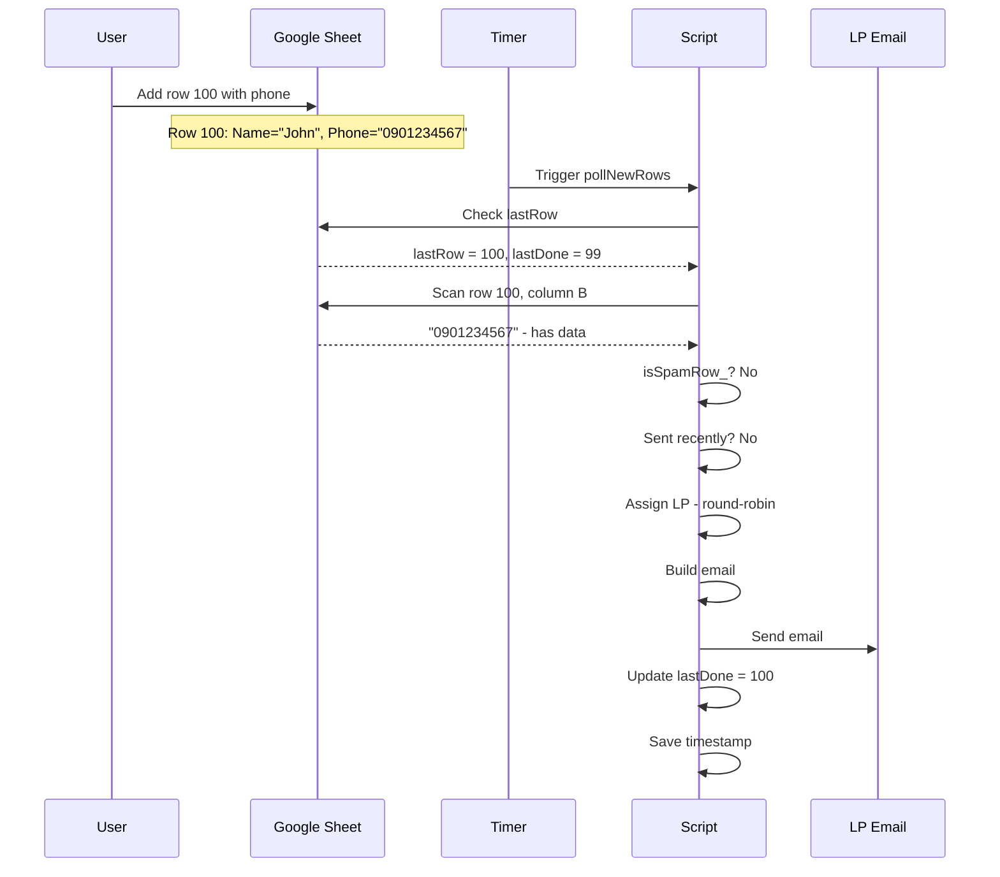

**Timeline**:
- T+0s: User adds row
- T+60s: Trigger fires
- T+61s: Email sent
- T+120s: Next trigger (no new rows)

---

### Scenario 2: Spam Detected

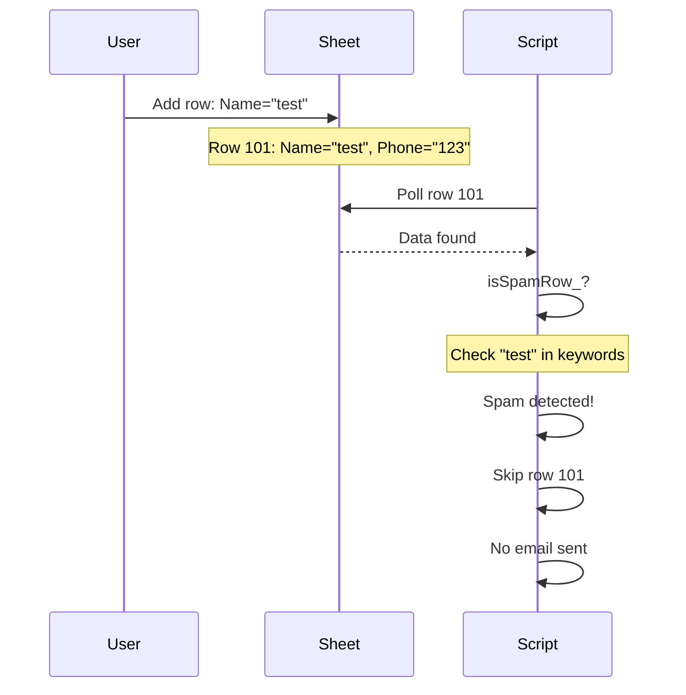

**Result**: Row skipped, no email sent

---

### Scenario 3: Multiple New Rows

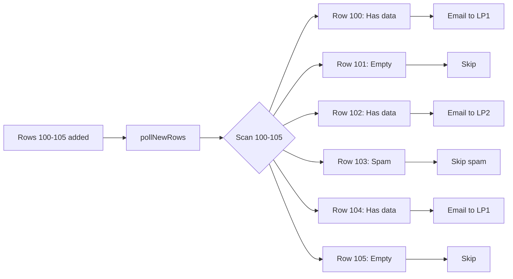

**Result**: 3 emails sent (rows 100, 102, 104) with round-robin LP assignment

---

## 🛡️ Safety Features

### 1. Duplicate Prevention
- **Mechanism**: Timestamp in Properties
- **Window**: 5 minutes
- **Key**: `seen:${sheetId}:${rowNum}`

### 2. Spam Filter
- **Check**: 47 keywords
- **Columns**: A, B, D, E, H
- **Method**: Case-insensitive substring

### 3. Validation Chain
- Sheet exists
- Row >= MIN_ROW
- Has data in trigger column
- Not spam
- Not sent recently

### 4. Thread Safety
- **Lock**: `LockService.getDocumentLock()`
- **Timeout**: 30 seconds
- **Scope**: Per document

### 5. Error Handling
- Try-catch blocks
- Console logging
- Email error notifications

---

## 🔍 Debugging Tips

### 1. Check Status
```javascript
checkStatus();
// Output: 
// ✅ Round Robin status: ON
// 📍 Starting row: Automatic (current last row)
```

### 2. Validate Configuration
```javascript
validateConfig();
// Checks sheets, columns, LP pool, email quota
```

### 3. Enable Dry Run
```javascript
enableDryRun();
// Log only, no real emails sent
```

### 4. Test Specific Row
```javascript
simulate(100);
// Simulate processing row 100
```

### 5. Check Logs
- Execution Logs in Google Apps Script Editor
- Look for: ⚠️, ❌, ✅, 📧 icons

---

## 📊 State Management

### Properties Service Keys

| Key | Value | Purpose |
|-----|-------|---------|
| `lastRow:${sheetId}` | Integer | Last processed row |
| `lpIdx:${sheetId}` | Integer | Current LP index |
| `seen:${sheetId}:${rowNum}` | Timestamp | Email sent time |

### Lifecycle

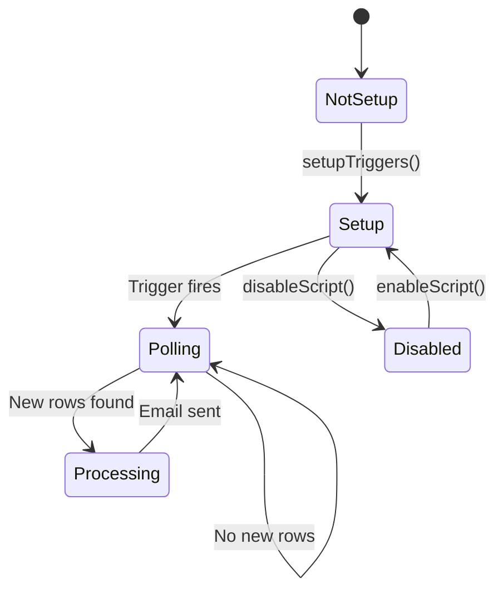

---

## 🎯 Best Practices

### 1. Setup
```javascript
// Run once when setting up new installation
setupTriggers();
```

### 2. Production Use
```javascript
// Ensure correct configuration
CONFIG.ENABLED = true;
CONFIG.DRY_RUN = false;
CONFIG.SPAM_FILTER.ENABLED = true;
```

### 3. Testing
```javascript
// Enable dry run when testing
enableDryRun();
simulate(2);
disableDryRun();
```

### 4. Monitoring
```javascript
// Periodically check status
checkStatus();
validateConfig();
```

---

## 🚀 Quick Start Guide

### 1. Initial Setup
```javascript
// Run in Script Editor
setupTriggers();
```

### 2. Verify
```javascript
checkStatus();
validateConfig();
```

### 3. Test
```javascript
enableDryRun();
sendTest();
// Check logs
disableDryRun();
```

### 4. Production
```javascript
enableScript();
// Script auto-runs every 1 minute
```

---

## � ZL Round Robin Variant

### Overview

The **ZL Round Robin** (`round_robin_ZL.js`) is a specialized variant designed for a different data source with specific requirements:

- **Auto-generated leadcodes** with prefix `ZL` (ZL0001, ZL0002, etc.)
- **Simplified LP pool** with specific team members
- **Modified data column mapping**
- **Same core functionality** as the main round robin script

---

### Key Differences from Main Script

| Feature | Main Script | ZL Variant |
|---------|-------------|------------|
| **Leadcode Column** | Column F (existing) | Auto-generated |
| **Leadcode Format** | From sheet data | `ZL0001`, `ZL0002`, ... |
| **Name Column** | Column A | Column B |
| **Phone Column** | Column B | Column C |
| **LP Pool** | Multiple LPs | Single endpoint: `asahi.data@trans-cosmos.com.vn` |
| **Email Brand** | `ALCV Lead Notifier` | `ALCV Lead Notifier - ZL Auto` |

---

### Configuration

#### LP Pool & Recipients
```javascript
RECIPIENTS_CC: [
  'ledangtrung_hieu@asahi-life.com.vn',
  'vuonghong_ngoc@asahi-life.com.vn',
  'lamphuoc_tuyen@asahi-life.com.vn',
  'nishimura_tomohiko@asahi-life.com.vn',
  'Nguyet.ntm@trans-cosmos.com.vn',
  'hoa.lt@trans-cosmos.com.vn'
],

LP_POOL: [
  { name: 'Leads mới', email: 'asahi.data@trans-cosmos.com.vn' }
]
```

#### Data Columns
```javascript
DATA_COLS: {
  NAME: 'B',        // Changed from 'A'
  PHONE: 'C',       // Changed from 'B'
  LEADCODE: null,   // Auto-generated, not from sheet
  COL_D: 'D',
  COL_E: 'E',
  COL_H: 'H'
}
```

#### Leadcode Auto-Generation
```javascript
LEADCODE_PREFIX: 'ZL',
LEADCODE_DIGITS: 4  // Results in: ZL0001, ZL0002, etc.
```

---

### Auto-Generation Logic

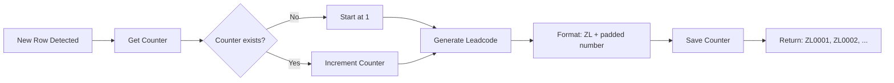

**Function**: `generateLeadcode_(sh)`

**Process**:
1. Get current counter from Properties Service
2. Increment counter
3. Pad number to 4 digits (e.g., 1 → 0001)
4. Concatenate prefix: `ZL + 0001 = ZL0001`
5. Save new counter value

**Properties Key**: `leadcodeCounter:${sheetId}`

---

### Email Template Differences

#### Subject Line
```
ALCV | New Lead / 新規リード → Leads mới
```

#### Email Content
- **Row Number** (Column #)
- **Name** (Column B)
- **Phone** (Column C)
- **Leadcode** (Auto-generated: ZL####)

Same table structure and styling as main script, but with modified column data.

---

### Setup Instructions

#### 1. Initial Setup
```javascript
// Run once in Script Editor
setupTriggers();
```

This will:
- Create time-driven trigger (every 1 minute)
- Initialize polling baseline
- Set up leadcode counter

#### 2. Verify Configuration
```javascript
checkStatus();
validateConfig();
```

Expected output:
```
✅ Round Robin status: ON
📍 Starting row: Automatic (current last row)
ℹ️ [Lead info] Leadcode will be auto-generated with format ZL0001
```

#### 3. Test Leadcode Generation
```javascript
enableDryRun();
simulate(2);  // Test with row 2
```

Check logs for:
```
🧪 [DRY RUN] Will send email to Leads mới (asahi.data@trans-cosmos.com.vn)
📝 Data: [{"row":2,"name":"...","phone":"...","leadcode":"ZL0001"}]
```

#### 4. Production
```javascript
disableDryRun();
enableScript();
```

---

### State Management

In addition to the standard Properties Service keys, ZL variant uses:

| Key | Value | Purpose |
|-----|-------|---------|
| `leadcodeCounter:${sheetId}` | Integer | Current leadcode number |
| `lastRow:${sheetId}` | Integer | Last processed row |
| `lpIdx:${sheetId}` | Integer | Always 0 (single LP) |
| `seen:${sheetId}:${rowNum}` | Timestamp | Duplicate prevention |

---

### Testing

#### Manual Row Processing
```javascript
processSpecificRows([100, 101, 102]);
```

Each row will receive a unique leadcode:
- Row 100 → ZL0001
- Row 101 → ZL0002
- Row 102 → ZL0003

#### Send Test Email
```javascript
sendTest();
```

Sends test email with sample data:
- Name: "Nguyễn Văn Test"
- Phone: "0901234567"
- Leadcode: "ZL0001"

---

### Leadcode Counter Reset

If you need to reset the leadcode counter:

```javascript
function resetLeadcodeCounter() {
  const ss = SpreadsheetApp.getActive();
  const props = PropertiesService.getDocumentProperties();
  
  CONFIG.SHEET_NAMES.forEach(sheetName => {
    const sh = ss.getSheetByName(sheetName);
    if (sh) {
      const key = `leadcodeCounter:${sh.getSheetId()}`;
      props.deleteProperty(key);
      console.log(`✅ Reset leadcode counter for ${sheetName}`);
    }
  });
}
```

> **⚠️ WARNING**: Resetting the counter may cause duplicate leadcodes if old emails were already sent.

---

### Common Use Cases

#### Use Case 1: New Lead Added
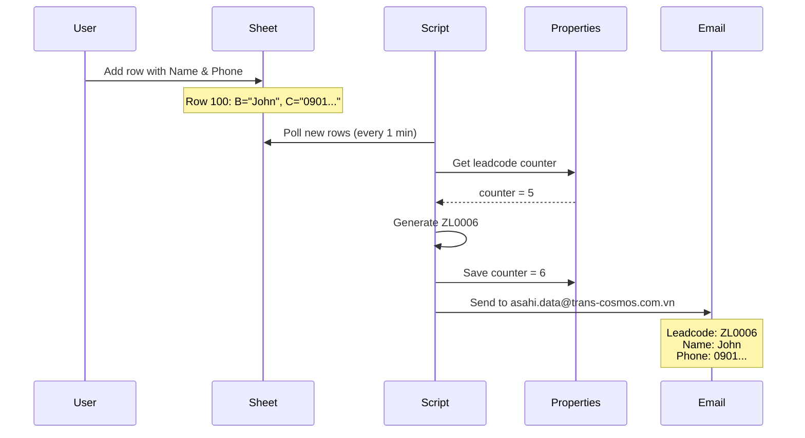

#### Use Case 2: Batch Import
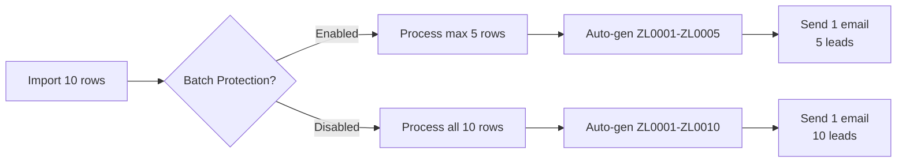

---

### Migration Guide

If migrating from manual leadcode entry to ZL auto-generation:

1. **Backup existing data**
2. **Determine starting counter value**:
   ```javascript
   // Set initial counter if needed
   const props = PropertiesService.getDocumentProperties();
   const sh = SpreadsheetApp.getActive().getSheetByName('Lead info');
   props.setProperty(`leadcodeCounter:${sh.getSheetId()}`, '100');
   ```
3. **Update CONFIG.DATA_COLS** to set `LEADCODE: null`
4. **Test with dry run**
5. **Deploy**

---

### Troubleshooting

#### Issue: Leadcode sequence skipped numbers
**Cause**: Multiple simultaneous triggers or errors during processing  
**Solution**: This is normal - counter increments even if email fails to prevent duplicates

#### Issue: Leadcode starts from ZL0001 every time
**Cause**: Properties not being saved  
**Solution**: Check script permissions for Properties Service access

#### Issue: Wrong data in email (name/phone swapped)
**Cause**: Incorrect column mapping  
**Solution**: Verify `DATA_COLS.NAME = 'B'` and `DATA_COLS.PHONE = 'C'`

---

## 📌 Summary

**Main Workflow**:
1. ⏰ Timer trigger every 1 minute
2. 🔍 Poll sheets to find new rows
3. ✅ Validate & filter spam
4. 🎲 Round-robin assign LP
5. 📧 Build & send email (7-column responsive table)
6. 💾 Update state

**Key Features**:
- ✅ Auto polling every 1 minute
- ✅ Round-robin LP assignment
- ✅ Spam filter with 47 keywords
- ✅ Duplicate prevention (5 min window)
- ✅ Thread-safe with Lock
- ✅ Manual testing functions
- ✅ Flexible configuration
- ✅ **[2025-12-22]** 7-column email table with Email, DoB, Intention fields
- ✅ **[2025-12-22]** Responsive mobile-friendly email layout
- ✅ **[2025-12-22]** Smart truncation with hover tooltips
- ✅ **[ZL Variant]** Auto-generated leadcodes with custom prefix
- ✅ **[ZL Variant]** Configurable digit padding (ZL0001, ZL0002, ...)
```
